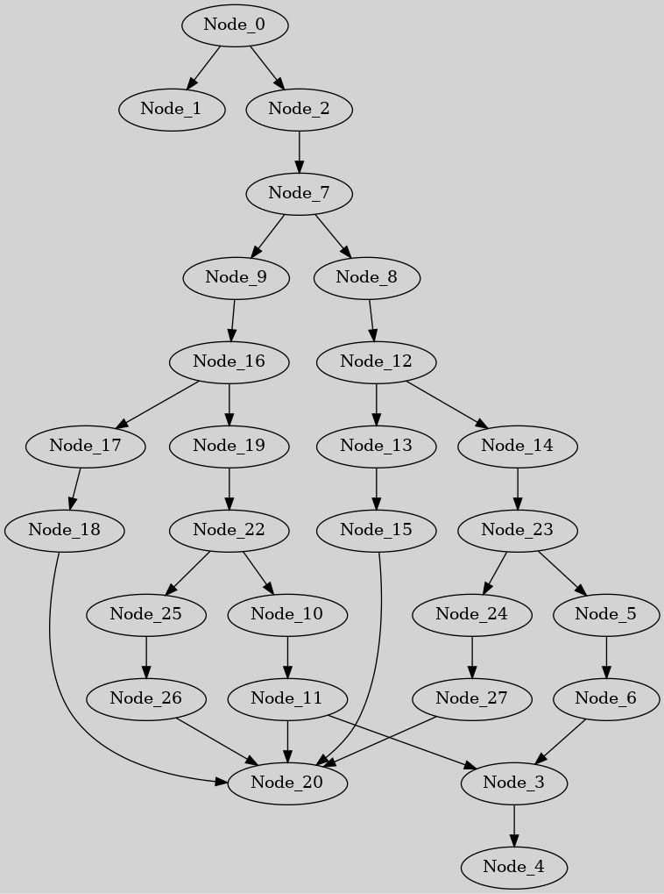
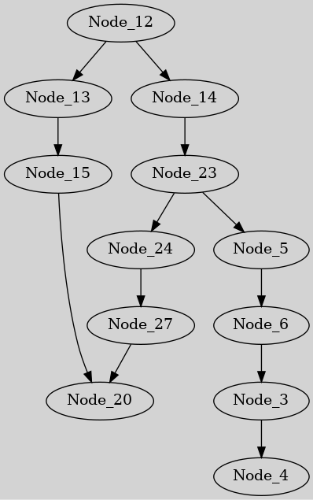

Generates subgraphs of the given flows depending on the arguments given and outputs an image.

## Dependencies
* Python 3
* pydot (`pip install pydot`)
* graphviz (probably available in your distro's repo)

## Example usage
```
./graph_reduce.py -f path/to/flow.json -o ~/Pictures/subgraph.png --action from_node -n some_widget_name
```

## Example output
|Full graph|From Node 12|
|----------|------------|
|||
